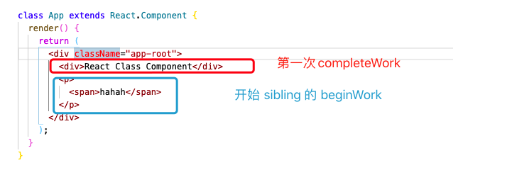

React 在 beginWork 的处理中会不断的创建 DOM 节点对应的 FiberNode，通过 return 和 children 连接起来，当 beginWork 执行到纯文本节点的时候就不会创建新的 FIber 了，而是返回 null，开始 completeWork 部分。

这个时候的 workInProgress 是整个 Fiber tree 最后一个的 FiberNode，把他传给 completeUnitOfWork 函数。

## completeWork

和 beginWork 的做法相同，completeUnitFoWork 里也是判断 completedWork !== null 来循环执行 completeWork 然后对 completedWork 做处理。beginWork 的顺序是从上到下生成每个 DOM 节点对应的 FiberNode，并将他们关联起来形成 Fiber tree 的过程。completeWork 则是从下到上，根据当前 completedWork（workInProgress） 对应的 FiberNode 生成真实 DOM。

所以 compelteWork 和 beginWork 一样，也是根据 workInProgress.tag 的类型来做不同的处理。（我们这次 completeWork 流程的 workInProgress 是 `<div>>React Class Component</div>` 对应的 FiberNode，他的 tag 就是 HostComponent）。

## HostComponent 的 completeWork

当 workInProgress.tag == HostComponent 时，会执行 careateInstance 函数，通过当前 workInProgress.type，在 createElement 里执行 document.createElement 创建对应的 DOM 节点。这个时候创建的 DOM 节点时没有内容的，是一个标签为 workInProgress.type 的纯 DOM。

在创建好 DOM 元素后，会接着执行 appendAllChildren ，这个函数里会判断是否有 workInProgress.child 做 DOM  的插入操作，因为这一次我们的 workInProgress 是最底层的 div 没有任何 children Node 所以先略过。

然后是将这次创建好的 div 赋值给 worInProgress.stateNode，接着执行下面的判断。在 finalizeInitialChildren 函数里对 DOM 做了一些初始化的工作，其中给 instance 添加 textContent 也在这部分里。

```js
// react-reconciler/src/ReactFiberCompleteWork.old.js
function completeWork(
  current: Fiber | null,
  workInProgress: Fiber,
  renderLanes: Lanes,
): Fiber | null {
    const newProps = workInProgress.pendingProps;
    switch (workInProgress.tag) {
        case HostComponent: {
          // 获取到 React 应用的根容器 <div id="app"></div>
          const rootContainerInstance = getRootHostContainer();
          const type = workInProgress.type;
          ...
          const instance = createInstance(
            type,
            newProps,
            rootContainerInstance,
            currentHostContext,
            workInProgress,
          );
          
          // 将子孙DOM节点插入刚生成的DOM节点中
          appendAllChildren(instance, workInProgress, false, false);
          // DOM节点赋值给fiber.stateNode
          workInProgress.stateNode = instance;
          
          if (
            // 初始化 DOM 对象的事件监听和内部属性
            // 还有做 DOM 的 autoFocus 判断
            finalizeInitialChildren(
              instance,
              type,
              newProps,
              rootContainerInstance,
              currentHostContext,
            )
          ) {
						
          }
        }
        
        return null;
    }
  }

// react-dom/src/client/ReactDOMHostConfig.js
export function createInstance(
  type: string,
  props: Props,
  rootContainerInstance: Container,
  hostContext: HostContext,
  internalInstanceHandle: Object,
): Instance {
  ...
  
  const domElement: Instance = createElement(
    type,
    props,
    rootContainerInstance,
    parentNamespace,
  );

  return domElement;
}

// react-dom/src/client/ReactDOMComponent.js
// 里面也对 type === 'script' 的情况有做处理
export function createElement(
  type: string,
  props: Object,
  rootContainerElement: Element | Document,
  parentNamespace: string,
): Element {
  // 返回的是 return 判断 rootContainerElement === DOCUMENT_NODE, 返回 document或者是 Node.ownerDocument 这里返回的是 rootContainerElement.ownerDocument 
  // 所以这里得到的是 当前 rootContainerElement 节点的顶层的 document 对象
  const ownerDocument: Document = getOwnerDocumentFromRootContainer(
    rootContainerElement,
  );
  let domElement: Element;
 	...
  domElement = ownerDocument.createElement(type);
  ...
  return domElement;
}
```

### finalizeInitialChildren  里添加 textContent

```js
// react-dom/src/client/ReactDOMHostConfig.js
export function finalizeInitialChildren(
  domElement: Instance,
  type: string,
  props: Props,
  rootContainerInstance: Container,
  hostContext: HostContext,
): boolean {
  setInitialProperties(domElement, type, props, rootContainerInstance);
  return shouldAutoFocusHostComponent(type, props);
}

// react-dom/src/client/ReactDOMComponent.js
export function setInitialProperties(
  domElement: Element,
  tag: string,
  rawProps: Object,
  rootContainerElement: Element | Document,
): void {
  const isCustomComponentTag = isCustomComponent(tag, rawProps);
	let props: Object;
  // 会根据 tag 做不同的处理
  switch (tag) {
     default:
      	props = rawProps;
  }

	setInitialDOMProperties(
    tag,
    domElement,
    rootContainerElement,
    props,
    isCustomComponentTag,
  );
}

// react-dom/src/client/ReactDOMComponent.js
function setInitialDOMProperties(
  tag: string,
  domElement: Element,
  rootContainerElement: Element | Document,
  nextProps: Object,
  isCustomComponentTag: boolean,
): void {
    for (const propKey in nextProps) {
      ...
      if (propKey === CHILDREN) {
        if (typeof nextProp === 'string') {

          const canSetTextContent = tag !== 'textarea' || nextProp !== '';
          if (canSetTextContent) {
            // 在这里 通过 node.textContent = text 对 domElement 添加 textContent
            setTextContent(domElement, nextProp);
          }
        }
      }
    }
  }
```

添加完 textContent 之后这一次的 completeWork 就执行完毕了，之后会判断当前的 completedWork.sibling 是否有兄弟元素如果有的话就 return  出去开始兄弟元素的 beginWork，并且更新当前的 workInProgress。 如果没有的话，就让当前的 completedWOrk = returnFiber 等于他父级的 FIberNode，也是更新 workInProgress，继续 completeWork。

以 <App/> 为例，第一次 completeWork 执行完毕后，他还有自己的兄弟节点，那么就执行兄弟节点的 beginWork。当兄弟节点的 beginWork 执行到纯文本节点时，再向上执行 completeWork，这里 span 的 completeWork 逻辑和之前 div 的一样。



span 的 completeWork 执行完成之后，他的 returnFiber 就是父标签 p 的 FIberNode，将 p 的 FiberNode 赋值给 completedWork，然后开始 p 的 completeWork。这部分前面的逻辑和 span 是一样的。不过之前略过的 appendAllChildren 方法，因为 p 的 FiberNode  有 children，所以我们来看看 appendAllChildren 的逻辑。

appendAllChildren 的逻辑其实很简单，先获取到当前 fiber 的 child fiber, 然后进入到 `while(node !== null)` 的循环里，然后判断 fiber.tag 的类型，调用 dom.appendChild 把 child fiber 的 stateNode （也就是对应的 DOM 节点）插入到当前 DOM 元素中。然后循环判断是否有其兄弟 fiber ，如果有的话就将当前 node 等于他的兄弟 fiber，接着循环。没有的话就将当前 node 等于他的 return fiber，直到 `node.return == null || node.return == workInProgress` 然后跳出循环。

其实说了这么多就是把当前 fiber 的 child.stateNode 插入到刚刚通过 createInstance 函数根据当前 fiber 创建的 DOM 元素里。然后将创建好的 DOM 赋值给当前 fiber.stateNode

p 标签的 completeWork 完成后，接着执行 `<div className="app-root"></div>` 的 completeWork，流程还是喝之前的一样。完成之后再向上找 return 找到 <App/> 的 FiberNode 继续 completeWork，不过当 fiber.tag 不是 HostComponent 的话就不会创建 DOM 标签了，这里直接 return null。 

最后在向上通过 return 找到根节点的 HostRoot Fiber，也就是做 beginWork 的第一个 Fiber，它的 tag 是 HostRoot，执行完它的 completeWork 后就再没有 return Fiber了，这时候跳出 completedWork 循环，然后把 `workInProgressRootExitStatus = RootCompleted = 5;`，把 HostRoot 的 workInProgress 复制给了 current

至此 render 阶段的 beginWork 和 completeWork 就结束了， workLoopSync 执行完毕后 break 出循环。

最后在 commit 阶段开始前声明了 finishedWork = root.current.alternate 也就是等于之前 render 阶段中构建好的 workInProgress tree。然后再挂在到 root （FiberRootNode）的 finishedWork 属性上。

然后就开始 commit 阶段啦

```js
// react-reconciler/src/ReactFiberWorkLoop.old.js
// root.current = HostRoot 的 current Fiber 
  const finishedWork: Fiber = (root.current.alternate: any);
  root.finishedWork = finishedWork;
  root.finishedLanes = lanes;

 	commitRoot(root);
```


