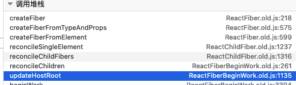
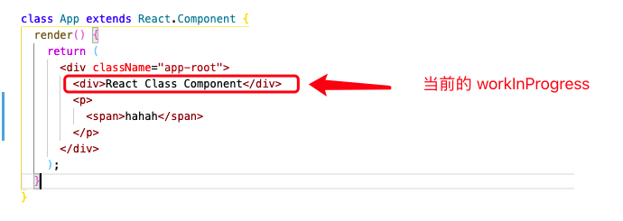

## performUnitOfWork 中的 beginWork 和 completeWork

performUnitOfWork 的工作内容分为两个部分，第一部分是通过 beginWork 生成当前 Fiber 的 children Fiber，并赋值给 workInProgress，在 workLoopSync 中不断的循环直到 workInProgress === null。第二部分当获取的 next === null 的时候，执行 completeUnitOfWork 开始 completeWork 阶段。

```js
// react-reconciler/src/ReactFiberWorkLoop.old.js
let workInProgress: Fiber | null = null;

function performUnitOfWork(unitOfWork: Fiber): void {
  
  const current = unitOfWork.alternate;
  let next;
  next = beginWork(current, unitOfWork, subtreeRenderLanes);
	if (next === null) {
    // If this doesn't spawn new work, complete the current work.
    completeUnitOfWork(unitOfWork);
  } else {
    // workInProgress = workInProgress.child 
    // workLoopSync 里循环的时候会判断 workLoopSync !== null 知道这里的 next = null  workLoopSync 才会跳出循环
    workInProgress = next;
  }
}

function workLoopSync() {
  // Already timed out, so perform work without checking if we need to yield.
  while (workInProgress !== null) {
    performUnitOfWork(workInProgress);
  }
}
```

## 执行 beginWork

performUnitOfWork 里的 beginWork 是一个过渡函数，里面调用了 originalBeginWork 方法，实际执行的是 ReactFiberBeginWork.old.js 里的 beginWork

beginWork 里通过判断 workInProgress.tag 判断当前 Fiber 是什么类型的，从而执行不同的逻辑。第一次渲染的时候，我们的 workInProgress Node 是我们最开始创建的 FIberRootNode.current ，他是一个类型为 `HostRoot` 的特殊 FiberNode，代表着整个Fiber tree 的根节点，充当最顶层组件的父级。所以第一遍 beginWork 的逻辑是 `workInProgress.tag === HostRoot` 然后执行 updateHostRoot 更新我们整个 Fiber tree 的根节点。

```js
// react-reconciler/src/ReactFiberBeginWork.old.js
function beginWork(
  current: Fiber | null,
  workInProgress: Fiber,
  renderLanes: Lanes,
): Fiber | null {
    switch (workInProgress.tag) {
      case HostRoot:
      	return updateHostRoot(current, workInProgress, renderLanes);
    }
  }
```

## updateHostRoot 创建子 Fiber 节点

首次 render 的时候 updateHostRoot 的主要工作内容就是给根节点的 hostRoot Fiber 创建子 Fiber，赋值给 workInProgress.child 并且返回给 next。整个 updateHostRoot 的调用栈如下图所示。

其中比较重要的点有：

1. 获取 updateQueue 里的 payload 也就是 之前赋值的 element JSX 赋值给 updateHostRoot 函数内声明的 nextChildren ，传给后面的函数，在后面会根据 nextChildren 上的 key, type, props 属性创建 Fiber
2. reconcileChildren 里通过判断 current === null 来区别是 mount 的组件还是 update 的组件。生成当前 workInProgress.children 对于首次 render 还没有生成自己的 children，所以在 reconcileChildren 里不做 Diff 算法，直接创建子节点的 Fiber，并将子节点的 Fiber 通过 return 属性和 HostRoot Fiber 链接起来。
3. 根据 element JSX（<App/>） 上的属性创建 Fiber （调用 createFiberFromElement 等一些列方法）



```js
// react-reconciler/src/ReactFiberBeginWork.old.js
function updateHostRoot(current, workInProgress, renderLanes) {
  ...
  // <App> JSX
  const nextChildren = nextState.element;
  
  ...
  
  // 里面判断 current ===null ？mountChildFibers ：reconcileChildFibers
  reconcileChildren(current, workInProgress, nextChildren, renderLanes);
  ...
  return workInProgress.child;
}

export function reconcileChildren(
  current: Fiber | null,
  workInProgress: Fiber,
  nextChildren: any,
  renderLanes: Lanes,
) {
    if (current === null) {
    // 对于mount的组件，他会创建新的子Fiber节点
    workInProgress.child = mountChildFibers(
      workInProgress,
      null,
      nextChildren,
      renderLanes,
    );
  } else {
	// 对于update组件会判断 current.child !== null 来做 Diff 或者直接创建子 Fiber
    workInProgress.child = reconcileChildFibers(
      workInProgress,
      current.child,
      nextChildren,
      renderLanes,
    );
  }
}


// react-reconciler/src/ReactChildFiber.old.js
function reconcileChildFibers(
    returnFiber: Fiber,
    currentFirstChild: Fiber | null,
    newChild: any,
    lanes: Lanes,
  ): Fiber | null {
			switch (newChild.$$typeof) {
        case REACT_ELEMENT_TYPE:
          return placeSingleChild(
            reconcileSingleElement(
              returnFiber,
              currentFirstChild,
              newChild,
              lanes,
            ),
          );
				......
      }      
}
      
function reconcileSingleElement(
    returnFiber: Fiber,
    currentFirstChild: Fiber | null,
    element: ReactElement,
    lanes: Lanes,
  ): Fiber {
      ......
      // 根据 element 属性创建子 Fiber
      const created = createFiberFromElement(element, returnFiber.mode, lanes);
      // 有 Ref 的话在里面做一些赋值操作
      created.ref = coerceRef(returnFiber, currentFirstChild, element);
      // 连接父级 fiber
      // 第一次 beginWork 的时候 returnFiber 是 rootFiber
      created.return = returnFiber;
      return created;
    }
```

这一遍流程走完之后，根节点 HostRoot 的 child Fiber 就创建成功了（<App/>）并且把它赋值给 workInProgress，此时的 workInProgress  就是 <App/> 的 Fiber Node 。然后继续 workLoopSync 里的循环，并把创建好的 child Fiber 当作新的 workInprogress 继续创建他的 children Fiber。

```js
function workLoopSync() {
  // Already timed out, so perform work without checking if we need to yield.
  while (workInProgress !== null) {
    performUnitOfWork(workInProgress);
  }
}

function performUnitOfWork(unitOfWork: Fiber) {
  ......
  next = beginwork(current, unitOfWork, subtreeRenderLanes);
  
  if (next === null) {
    // If this doesn't spawn new work, complete the current work.
    completeUnitOfWork(unitOfWork);
  } else {
    // workInProgress = workInProgress.child 
    // workLoopSync 里循环的时候会判断 workLoopSync !== null 直到这里的 next = null  workLoopSync 才会跳出循环
    workInProgress = next;
  }
}
```

## 第二遍 beginWork 创建 <App/> 的 children Fiber

还是相同的逻辑，循环执行 performUnitOfWork 开始 beginWork，判断当前 workInProgress.tag ，这次的 workInProgress 是 <App/> 的 Fiber，所以进入到 ClassComponent 的逻辑，执行 updateClassComponent。

```js
// react-reconciler/src/ReactFiberBeginWork.old.js
function beginWork(
  current: Fiber | null,
  workInProgress: Fiber,
  renderLanes: Lanes,
): Fiber | null {
    ...
    switch (workInProgress.tag) {
      case ClassComponent: {
      const Component = workInProgress.type;
      const unresolvedProps = workInProgress.pendingProps;
      const resolvedProps =
        workInProgress.elementType === Component
          ? unresolvedProps
          : resolveDefaultProps(Component, unresolvedProps);
      return updateClassComponent(
          current,
          workInProgress,
          Component,
          resolvedProps,
          renderLanes,
        );
      }
    }
  }
```

第一次 render 执行 updateClassComponent 时会判断 `workInProgress.stateNode === null` 执行 constructClassInstance 和 mountClassInstance 方法。

其中  constructClassInstance 最主要的操作是对 class App 执行了 new 操作，然后挂载到当前 workInProgress.stateNode 上。最后返回 new App 的结果。mountClassInstance 包含一些声明周期和 state 更新的操作。

最终执行 finishClassComponent 方法，在这个方法里执行了 <App/> 组件的 render 方法，并赋值给了 nextChildren，然后就是执行 reconcileChildren 方法，把 nextChildren 传递进去，判断是否是 mount 还是 update，执行 mountChildFibers 创建子 Fiber 了。最后赋值给当前的 workInProgress.child。

```js
// react-reconciler/src/ReactFiberBeginWork.old.js
function updateClassComponent(
  current: Fiber | null,
  workInProgress: Fiber,
  Component: any,
  nextProps: any,
  renderLanes: Lanes,
) {
    ...
    const instance = workInProgress.stateNode;
    let shouldUpdate;
    if (instance === null) {
      ...
      constructClassInstance(workInProgress, Component, nextProps);
      mountClassInstance(workInProgress, Component, nextProps, renderLanes);
      shouldUpdate = true;
    }
    
    ...
    
    const nextUnitOfWork = finishClassComponent(
      current,
      workInProgress,
      Component,
      shouldUpdate,
      hasContext,
      renderLanes,
    );
    return nextUnitOfWork
  }

function finishClassComponent(
  current: Fiber | null,
  workInProgress: Fiber,
  Component: any,
  shouldUpdate: boolean,
  hasContext: boolean,
  renderLanes: Lanes,
) {
    ...
    const instance = workInProgress.stateNode;
    ...
    nextChildren = instance.render();
    ...
    reconcileChildren(current, workInProgress, nextChildren, renderLanes);
    ...
    return workInProgress.child;
  }

export function reconcileChildren(
  current: Fiber | null,
  workInProgress: Fiber,
  nextChildren: any,
  renderLanes: Lanes,
) {
  if (current === null) {
    workInProgress.child = mountChildFibers(
      workInProgress,
      null,
      nextChildren,
      renderLanes,
    );
  }
}

// react-reconciler/src/ReactChildFiber.old.js
function reconcileChildFibers(
    returnFiber: Fiber,
    currentFirstChild: Fiber | null,
    newChild: any,
    lanes: Lanes,
  ): Fiber | null {
  	...
    switch (newChild.$$typeof) {
      case REACT_ELEMENT_TYPE:
          return placeSingleChild(
            reconcileSingleElement(
              returnFiber,
              currentFirstChild,
              newChild,
              lanes,
            ),
          );
      ...
    }
  }
```

### 创建 children Fiber

在前面的操作中，React 对 class App 执行了 new 操作，并且执行了他的 render 方法，获取到了 App 的 JSX，并赋值给了 nextChildren，在后面的操作中会根据 nextChildren 上的 type, key 等属性创建子 Fiber

```js
// react-reconciler/src/ReactChildFiber.old.js
function reconcileSingleElement(
    returnFiber: Fiber,
    currentFirstChild: Fiber | null,
    element: ReactElement,
    lanes: Lanes,
  ): Fiber {
   		...
    	const created = createFiberFromElement(element, returnFiber.mode, lanes);
      // 有 Ref 的话在里面做一些赋值操作
      created.ref = coerceRef(returnFiber, currentFirstChild, element);
      // 连接父级 fiber
      created.return = returnFiber;
      return created;
  }

// react-reconciler/src/ReactFiber.old.js
export function createFiberFromElement(
  element: ReactElement,
  mode: TypeOfMode,
  lanes: Lanes,
): Fiber {
  // 此时的 element 是 <App/> render() 返回的 JSX 是一群<div>
  // type = 'div'
  const type = element.type;
  const key = element.key;
  // 其余的 className, childrens 都在 element.props, 具体可以看 createElement 函数
  const pendingProps = element.props;
  const fiber = createFiberFromTypeAndProps(
    type,
    key,
    pendingProps,
    owner,
    mode,
    lanes,
  );
  return fiber;
}

export function createFiberFromTypeAndProps(
  type: any, // React$ElementType
  key: null | string,
  pendingProps: any,
  owner: null | Fiber,
  mode: TypeOfMode,
  lanes: Lanes,
): Fiber {
  let fiberTag = IndeterminateComponent;
  ...
  // 因为传进来的 type = element.type = 'div',所以这里的 fiberTag = HostComponent
  // 表示是原声组件如 div, p , span  这种
  if (typeof type === 'string') {
    fiberTag = HostComponent;
  }
  
  ...
  
  const fiber = createFiber(fiberTag, pendingProps, key, mode);
  fiber.elementType = type;
  fiber.type = resolvedType;
  fiber.lanes = lanes;
  
  return fiber;
}
```

createFiber 创建好 fiber 后再返回给当前的 workInProgress.child，至此第二遍的 beginWork 就走完了，此时的 worInProgress 就是 class App render() 后的 FiberNode，也就是最外层 div 对应的 FiberNode。这个时候他还有子节点没有创建对应的 FiberNode， 并且赋值后的 workInProgress !== null ，所以还需要继续循环执行 beginWork

## 第三遍 beginWork render HostComponent

第三次执行 beginWork 的时候，我们当前的 workInProgress 就是 <App/> 组件里的 <div className="app-root""></div> 的 FiberNode。此时的 workInProgress.tag == HostComponent 代表原生标签。然后执行 updateHostComponent

```js
function beginWork(
  current: Fiber | null,
  workInProgress: Fiber,
  renderLanes: Lanes,
): Fiber | null {
    switch (workInProgress.tag) {
      case HostComponent:
      	return updateHostComponent(current, workInProgress, renderLanes);
    }
  }
```

当 workInProgress 是原生标签的时候，nextChildren 取得就是他 props.children，然后在判断 nextChildren 是不是纯文本，如果是的话  nextChildren = null 意味着不会再创建 childrenFiber 了。不是的话就继续创建 childrenFiber，直到他的 props.children 是纯文本为止。

```js
// react-reconciler/src/ReactFiberBeginWork.old.js
function updateHostComponent(
  current: Fiber | null,
  workInProgress: Fiber,
  renderLanes: Lanes,
) {
    ...
    const type = workInProgress.type;
    const nextProps = workInProgress.pendingProps;
    const prevProps = current !== null ? current.memoizedProps : null;

    // 拿到 Jsx 的 props.children 
    let nextChildren = nextProps.children;
    // 判断是不是纯文本
    const isDirectTextChild = shouldSetTextContent(type, nextProps);
    
    if (isDirectTextChild) {
      nextChildren = null;
    }
    ...
    
    reconcileChildren(current, workInProgress, nextChildren, renderLanes);
  	return workInProgress.child;
  }

// 接着还是 reconcileChildren 里判断是 mount 还是 update，首次 render 所以还是 mount
export function reconcileChildren(
  current: Fiber | null,
  workInProgress: Fiber,
  nextChildren: any,
  renderLanes: Lanes,
) {
  if (current === null) {
    workInProgress.child = mountChildFibers(
      workInProgress,
      null,
      nextChildren,
      renderLanes,
    );
  }
}
```

因为我们的 <App/> 组件长这个样子，所以这次的 nextChildren 是一个数组，那么就会进入到新的判断逻辑中去。 reconcileChildFibers  会通过 isArray 判断 newChild 是不是数组，然后进入到 reconcileChildrenArray 里，在这个函数里面有做一部分的 Diff 的东西，但是我们只关注第一次 render 的部分，可以先略过。

```jsx
class App extends React.Component {
  render() {
    return (
      <div className="app-root">
        <div>React Class Component</div>
        <p><span>hahah</span></p>
      </div>
    );
  }
}
```

```js
function reconcileChildFibers(
    returnFiber: Fiber,
    currentFirstChild: Fiber | null,
    newChild: any,
    lanes: Lanes,
  ): Fiber | null {
		...
  
  	if (isArray(newChild)) {
      return reconcileChildrenArray(
        returnFiber,
        currentFirstChild,
        newChild,
        lanes,
      );
    }
}
```

### reconcileChildrenArray render 阶段循环创建 childFiber

他的主要逻辑就是遍历 newChildren 这个数组，每次循环的时候都通过 createChild 创建当前数组里每一项 children 的 FiberNode，然后把创建的第一个 childFiber 赋值给 resultingFirstChild，后面创建的 FiberNode 都通过 sibling 属性和前一个关联起来。最后把第一个 FiberNode 返回出去。这样这一层的所有子节点的 Fiber 就都创建好了，并且由 sibling 属性将他们链接了起来。

```js
// react-reconciler/src/ReactChildFiber.old.js
function reconcileChildrenArray(
    returnFiber: Fiber,
    currentFirstChild: Fiber | null,
    newChildren: Array<*>,
    lanes: Lanes,
  ): Fiber | null {
 	
    let resultingFirstChild: Fiber | null = null;
    let previousNewFiber: Fiber | null = null;

    let oldFiber = currentFirstChild;
    let lastPlacedIndex = 0;
    let newIdx = 0;
    let nextOldFiber = null;    
      
     ... 省略一部分 Diff 处理,第一次 render 的时候会直接跳过
    
     if (oldFiber === null) {
      for (; newIdx < newChildren.length; newIdx++) {
        // 根据 newChildren[newIdx] 上的属性创建 fiberNode
        const newFiber = createChild(returnFiber, newChildren[newIdx], lanes);
        if (newFiber === null) {
          continue;
        }
        
        // 把 newChildren[0] 赋值给 resultingFirstChild，把剩下的赋值给 newFiber.sibling 
        // resultingFirstChild 是第一个 newFiber, 剩余的都是 resultingFirstChild.sibling 
        if (previousNewFiber === null) {
          // TODO: Move out of the loop. This only happens for the first run.
          resultingFirstChild = newFiber;
        } else {
          previousNewFiber.sibling = newFiber;
        }
        previousNewFiber = newFiber;
      }
      return resultingFirstChild;
    }
 }
```

第三遍 beginWork 执行完成后，当前的 workInProgress 就就是 nextChild[0] 的 FiberNode，其他的同级兄弟 DOM 的 FiberNode 在 workInProgress.sibling 上。



## 第四次 beginWork 对于纯文本节点的处理

上一次的 beginWork 创建好了 `<div className="app-root"></div>` 的第一层子节点对应的 FiberNode 之后，继续向下执行深度优先遍历，开始第四次的 beginWork，这次要创建的是 `<div>React Class Component</div>` 内部纯文本的 FiberNode，而 react 会如何处理呢？

首先依然还是走之前 beginWork 的逻辑，然后判断 workInProgress.tag，然后执行 updateHostComponent，但是这次会通过 shouldSetTextContent 判断出当前 workInProgress.props 里的 children 是否是纯文本，如果是的话 nextChildren 的值为 null。那么在后面的 `reconcileChildren` 逻辑中就不会去创建纯文本对应的 Fiber 了。

那么这次的 beginWork 返回的值就 null，在 performUnitOfWork 中会判断 next === null 执行 completeUnitOfWork，开始 complete 阶段。

```js
// react-reconciler/src/ReactFiberWorkLoop.old.js
function performUnitOfWork(unitOfWork: Fiber): void {
  let next;
  next = beginWork(current, unitOfWork, subtreeRenderLanes);
	if (next === null) {
    // If this doesn't spawn new work, complete the current work.
    completeUnitOfWork(unitOfWork);
  }
}
```


