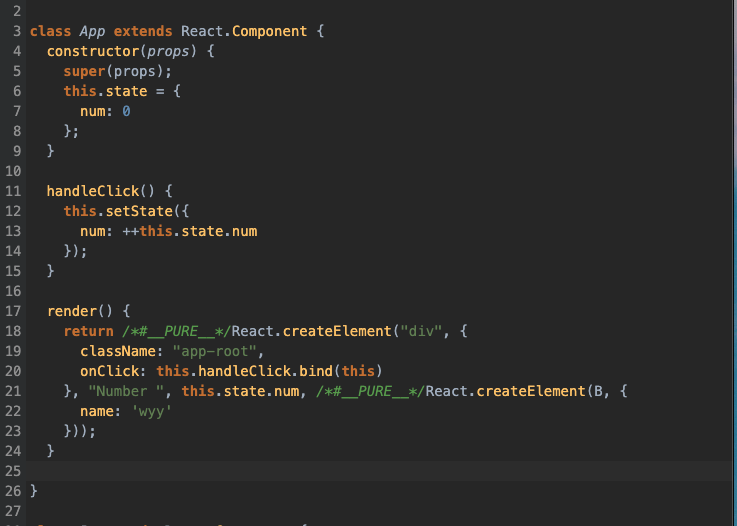

## 在 ClassComponent 中，组件 render 的时候是如何渲染的

```js
class App extends React.Component {
  constructor(props) {
    super(props);
    this.state = {
      num: 0,
    };
  }

  handleClick() {
    this.setState({
      num: ++this.state.num,
    });
  }

  render() {
    return (
      <div className="app-root" onClick={this.handleClick.bind(this)}>
        Number {this.state.num}
        <B name={'wyy'} />
      </div>
    );
  }
}
```



我们以这个 <App/> 为例子，经过 babel 编译后 <App/> 的 JSX 转为了 React.createElement 函数，会将 `{this.state.num}`以 JS 的执行结果作为 children 参数传递给 React.createElement。

我们之前看了 React.createElement 的实现，它接受三个参数 type, config, children, 当接收的参数过多时， createElement 会遍历 arguments 然后创建一个数组，将 arguments[i + 2] 添加到数组里，最终赋值给 props.children。也就是说在 JSX 里的 state 最终是以 props.children 的形式存在于 React Element 上的

```js
export function createElement(type, config, children) {
  ...
  const childrenLength = arguments.length - 2;
  if (childrenLength === 1) {
    props.children = children;
  } else if (childrenLength > 1) {
    const childArray = Array(childrenLength);
    for (let i = 0; i < childrenLength; i++) {
      childArray[i] = arguments[i + 2];
    }
    props.children = childArray;
  }
}
```

## beginWork 创建对应 Fiber

了解了之前 react render 的流程，我们知道在 beginWork 中会执行 updateClassComponent 来创建子组件对应的 Fiber，在 updateClassComponent 里做了两件比较重要的事： 1. new App() 实例化组件 2: 执行 <App/> 的render 函数，通过 render 函数的返回值去创建 children fiber。

所以 render 函数执行完成后，拿到的结果是这个样子的：

```js
nextChildren = instance.render()
nextChildren = {
  ...
  props: {
    children: ["Number", 0],
    className: "app-root",
    onClick: handleClick()
  }
}
```

其中 props.children 里的 "Number" 对应的就是  JSX 里的纯文本 "Number"， 0 对应的就是 `{this.state.num}` 的 JS 执行结果。

那么后面的流程就非常的清晰明了了，通过 new App().render() 方法的结果 nextChildren 执行 mountChildFibers ，后面的流程就和 react render 一样了，beginWork 创建每一层的 Fiber Node，然后 completeWork 创建对应的真实 DOM 然后插入到页面中。
