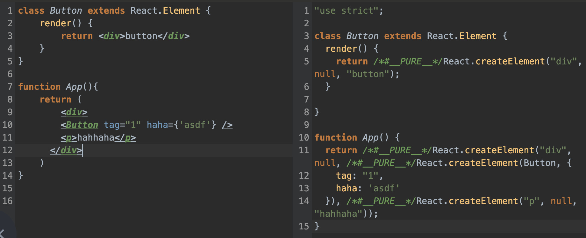

# JSX 的本质是什么

其实在 babel 官网中的试一试里，可以看到，React 的 jsx 代码通过 babel 编译后会转化成 React.createElement 函数



我们来看看 `React.createElement` 里发生了什么

## React.createElement

```js
// /packages/react/src/ReactElement.js

// type: jsx 节点，当节点是小写的时候 type 值是字符串的 jsx 节点，所以 react 组件需要首字母大写
// config: props 相关
// children: props.children
export function createElement(type, config, children) {
  let propName;

  // Reserved names are extracted
  // 声明了 props, key, ref 等
  const props = {};

  let key = null;
  let ref = null;

  
  // 对 ref, key, 遍历 config 对 props 赋值
  if (config != null) {
    if (hasValidRef(config)) {
      ref = config.ref;
    }
    if (hasValidKey(config)) {
      key = '' + config.key;
    }

    // Remaining properties are added to a new props object
    for (propName in config) {
      if (
        hasOwnProperty.call(config, propName) &&
        !RESERVED_PROPS.hasOwnProperty(propName)
      ) {
        props[propName] = config[propName];
      }
    }
  }
  
  // createElement 除了前两个参数以为其他都是 props.children
  // 有多个 children 的时候 props.children 是一个数组
  const childrenLength = arguments.length - 2;
  if (childrenLength === 1) {
    props.children = children;
  } else if (childrenLength > 1) {
    const childArray = Array(childrenLength);
    for (let i = 0; i < childrenLength; i++) {
      childArray[i] = arguments[i + 2];
    }
    props.children = childArray;
  }

  // Resolve default props
  if (type && type.defaultProps) {
    const defaultProps = type.defaultProps;
    for (propName in defaultProps) {
      if (props[propName] === undefined) {
        props[propName] = defaultProps[propName];
      }
    }
  }
  
  return ReactElement(
    type,
    key,
    ref,
    self,
    source,
    ReactCurrentOwner.current,
    props,
  );
}

```

通过传递进来的参数对 `key ref props children` 赋值后，再传入 `ReactElement` 函数里，而 `ReactElement` 最终返回的是一个 `element object`，在 React 里的 jsx 都是用这个对象来表示的

```js
const ReactElement = function(type, key, ref, self, source, owner, props) {
  const element = {
    // This tag allows us to uniquely identify this as a React Element
    // 表示的是 react 对象
    $$typeof: REACT_ELEMENT_TYPE,

    // Built-in properties that belong on the element
    type: type,
    key: key,
    ref: ref,
    props: props,

    // Record the component responsible for creating this element.
    _owner: owner,
  };
   return element;
}; 

// packages/shared/ReactSymbols.js
export let REACT_ELEMENT_TYPE = 0xeac7;
if (typeof Symbol === 'function' && Symbol.for) {
  const symbolFor = Symbol.for;
  REACT_ELEMENT_TYPE = symbolFor('react.element');
 ...
}
```

