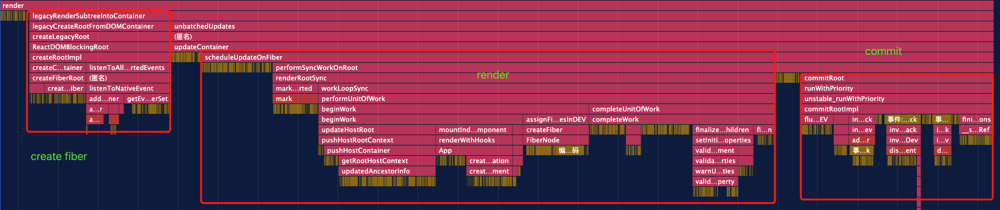
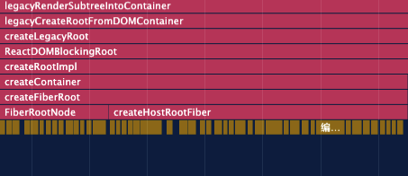

我们从 React 的执行栈中可以把他的整个执行阶段大致分为三个部分，分别是：

- create fiber 阶段（mount）
- render 阶段
- commit 阶段



我们具体了解一下 create fiber（mount） 阶段。



从调用栈中可以看到他的函数调用顺序，然后我们具体看一下代码都做了什么事情

## ReactDOM.render

从入口函数开始，可以看到我们的 render 函数只是调用了 legacyRenderSubtreeIntoContainer ，也就是执行栈的第一个函数

```js
// react-dom/src/client/ReactDOMLegacy.js
export function render(
  element: React$Element<any>,
  container: Container,
  callback: ?Function,
) {

  return legacyRenderSubtreeIntoContainer(
    null,
    element,
    container,
    false,
    callback,
  );
}
```


## legacyRenderSubtreeIntoContainer 

legacyRenderSubtreeIntoContainer 是整个 react 执行阶段的主函数，是我们之前分的三个阶段的开始函数。在 legacyRenderSubtreeIntoContainer 函数里，通过 legacyCreateRootFromDOMContainer 函数执行，开始 create fiber 阶段，

```js
// react-dom/src/client/ReactDOMLegacy.js
function legacyRenderSubtreeIntoContainer(
  parentComponent: ?React$Component<any, any>,
  children: ReactNodeList,
  container: Container,
  forceHydrate: boolean,
  callback: ?Function,
) {
   let root: RootType = (container._reactRootContainer: any);
   let fiberRoot; 
      // 首次渲染页面还没有挂载任何DOM，所以 root 是 null
  if (!root) {
    // Initial mount
    // mount 阶段
    // 创建了 FiberRootNode (root._internalRoot)
    // 通过 legacyCreateRootFromDOMContainer 创建 Fiber
    root = container._reactRootContainer = legacyCreateRootFromDOMContainer(
      container,
      forceHydrate,
    );
  }
}
```

##  legacyCreateRootFromDOMContainer

legacyCreateRootFromDOMContainer 会将我们的容器里其他的 child 删除掉，只留下一个最外层的 div 容器，然后再执行调用栈里的 createLegacyRoot 函数。

比如，我们的 react 根容器是这个样子的：

```html
  <div id="app">
    <p>ahsdlf</p>
    <div>
      <p>
        <span>haha</span>
      </p>
    </div>
  </div> 
```

那么 legacyCreateRootFromDOMContainer 会将 id = app 的 div 里的所有内容全部删除，只留下一个空的 `<div id="app"></div>` 的容器。

``` js
// react-dom/src/client/ReactDOMLegacy.js
function legacyCreateRootFromDOMContainer(
  container: Container,
  forceHydrate: boolean,
): RootType {
  const shouldHydrate =
    forceHydrate || shouldHydrateDueToLegacyHeuristic(container);
  // First clear any existing content.
  if (!shouldHydrate) {
    let warned = false;
    let rootSibling;
    // 在这个循环里不断判断是否有 lastChild 然后并删除它
    while ((rootSibling = container.lastChild)) {
      container.removeChild(rootSibling);
    }
  }

  return createLegacyRoot(
    container,
    shouldHydrate
      ? {
          hydrate: true,
        }
      : undefined,
  );
}
```

## createRootImpl 开始创建 container

createLegacyRoot 里返回的是 new ReactDOMBlockingRoot 对象，而在 ReactDOMBlockingRoot 里则执行了 createRootImpl 函数，并且把他赋值到了 ReactDOMBlockingRoot 的 this._internalRoot 上。

```js
// react-dom/src/client/ReactDOMRoot.js
export function createLegacyRoot(
  container: Container,
  options?: RootOptions,
): RootType {
  // 当执行 ReactDOM.render 的时候是 legacy 模式，这里传入的 tag 就是 LegacyRoot
  return new ReactDOMBlockingRoot(container, LegacyRoot, options);
}

function ReactDOMBlockingRoot(
  container: Container,
  tag: RootTag,
  options: void | RootOptions,
) {
  this._internalRoot = createRootImpl(container, tag, options);
}

```

在 createRootImpl 里通过 createContainer 来创建 FiberRootNode，然后赋值给函数内部属性 root，最后再返回出去。

createContainer 里返回的是 createRiberRoot 里最终创建的 FiberRootNode 节点。

```js
// react-dom/src/client/ReactDOMRoot.js
function createRootImpl(
  container: Container,
  tag: RootTag,
  options: void | RootOptions,
) {
    ...
    const root = createContainer(container, tag, hydrate, hydrationCallbacks);
    ...
    return root;
  }
// createContainer 只是一层过渡，真正创建FiberRootNode是在 createRiberRoot 里
export function createContainer(
  containerInfo: Container,
  tag: RootTag,
  hydrate: boolean,
  hydrationCallbacks: null | SuspenseHydrationCallbacks,
): OpaqueRoot {
  return createFiberRoot(containerInfo, tag, hydrate, hydrationCallbacks);
}
```

## FiberRootNode 和 rootFiber

createFiberRoot 函数里会通过 new FiberRootNode 创建出 fiberRootNode，以及通过 createHostRootFiber 函数创建 rootFiber。其中 fiberRootNode 是整个应用的根节点，并且应用中只有 一个 fiberRootNode，而 rootFiber 是 `<App/>` 所在组件树的根节点也就是 HostRoot。他们的区别则是，在应用中我们可以通过 ReactDOM.render 渲染不同的组件树，他们会拥有不同的 rootFiber，但是在整个 react 应用中， fiberRootNode 只有一个。然后通过 fiberRootNode.current = rootFiber, rootFiber.stateNode = fiberRootNode 让他们互相指向对方。

```js
// react-reconciler/src/ReactRiberRoot.old.js
export function createFiberRoot(
  containerInfo: any,
  tag: RootTag,
  hydrate: boolean,
  hydrationCallbacks: null | SuspenseHydrationCallbacks,
): FiberRoot {
  // 这里创建唯一的 riberRootNode
  const root: FiberRoot = (new FiberRootNode(containerInfo, tag, hydrate): any);
  if (enableSuspenseCallback) {
    root.hydrationCallbacks = hydrationCallbacks;
  }

  // Cyclic construction. This cheats the type system right now because
  // stateNode is any.
  // 这里创建 rootFiber， FiberRootNode.current 指向这里创建的 rootFiber
  // rootFiber.stateNode 指向唯一的 FiberRootNode
  // 这里的 rootFiber 就是我们的 Fiber 树了
  const uninitializedFiber = createHostRootFiber(tag);
  root.current = uninitializedFiber;
  uninitializedFiber.stateNode = root;
  // 更新相关，给 rootFiber 添加 updateQueue 对象
  initializeUpdateQueue(uninitializedFiber);

  return root;
}
```

createHostRootFiber 里根据优先级设置了 fiber 上的 mode 的值，然后调用 createFiber 函数，最终在 createFiber 函数里 new FiberNode 对象，到此 fiber 就创建成功了。然后再一级一级的返回出去，最终给到 legacyRenderSubtreeIntoContainer 里声明的 root 以及 container._reactRootContainer。

```js
// react-reconciler/src/ReactFiber.old.js
export function createHostRootFiber(tag: RootTag): Fiber {
  let mode;
  if (tag === ConcurrentRoot) {
    mode = ConcurrentMode | BlockingMode | StrictMode;
  } else if (tag === BlockingRoot) {
    mode = BlockingMode | StrictMode;
  } else {
    // 这里的 NoMode 应该是一个代表优先级的二进制车道？？？
    // const NoMode = 0b00000
    mode = NoMode;
  }

  if (enableProfilerTimer && isDevToolsPresent) {
    // Always collect profile timings when DevTools are present.
    // This enables DevTools to start capturing timing at any point–
    // Without some nodes in the tree having empty base times.
    mode |= ProfileMode;
  }
  // HostRoot = 3 创建 HostRoot Fiber
  return createFiber(HostRoot, null, null, mode);
}

const createFiber = function(
  tag: WorkTag,
  pendingProps: mixed,
  key: null | string,
  mode: TypeOfMode,
): Fiber {
  // $FlowFixMe: the shapes are exact here but Flow doesn't like constructors
  return new FiberNode(tag, pendingProps, key, mode);
};
```

## initializeUpdateQueue 在 rootFiber 上添加 updateQueue 对象

```js
// react-reconciler/src/ReactUpdateQueue.old.js
export function initializeUpdateQueue<State>(fiber: Fiber): void {
  const queue: UpdateQueue<State> = {
    baseState: fiber.memoizedState,
    firstBaseUpdate: null,
    lastBaseUpdate: null,
    shared: {
      pending: null,
    },
    effects: null,
  };
  fiber.updateQueue = queue;
}
```


## FiberNode

```js
// react-reconciler/src/ReactFiber.old.js

function FiberNode(
  tag: WorkTag,
  pendingProps: mixed,
  key: null | string,
  mode: TypeOfMode,
) {
    // Instance
  // 静态属性相关
  this.tag = tag; //对应组件的类型
  this.key = key; //key属性
  this.elementType = null; //元素类型
  this.type = null; //func或者class
  this.stateNode = null; // FiberRootNode

  // Fiber
  // 用来连接其他fiber节点，形成fiber树
  this.return = null;
  this.child = null;
  this.sibling = null;
  this.index = 0;

  // ref
  this.ref = null;

  // 动态的工作单元
  this.pendingProps = pendingProps;
  this.memoizedProps = null;
  this.updateQueue = null;
  this.memoizedState = null;
  this.dependencies = null;

  this.mode = mode;

  // Effects
  this.flags = NoFlags;
  this.nextEffect = null;

  this.firstEffect = null;
  this.lastEffect = null;

  // 优先级相关
  this.lanes = NoLanes;
  this.childLanes = NoLanes;

  this.alternate = null;
  }
```


